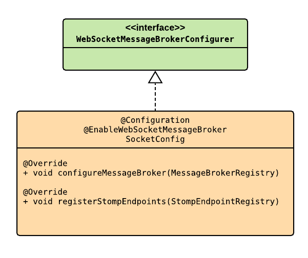

# WebSocket
Webocket is a protocol and an api, for continuous full-duplex communication over the TCP protocol. WebSocket defines how a stream of bytes is transformed into frames, frames that can contain a binary message or in text, but it does not implement how to route or process it. It allows the use of sub-protocols that operate at a higher level of application like STOMP.


STOPM (simple text-based message protocol), is a high level protocol, define frame types (CONNECT, SUBSCRIBE, UNSUBSCRIBE, ACK, or SEND.) which are mapped onto websocket frames.

The WebSocket protocol is called TCP for web. Analogically, STOMP is called HTTP for web.


### In Java
 Java define a WebSocket API [JSR 356](https://jcp.org/en/jsr/detail?id=356).
 
### In Spring Boot
Spring Boot includes a compatible Spring-WebSocket module with the JSR 356.

The Starter ```spring-boot-starter-websocket``` include ```SockJS``` and ```STOMP```.

For configure WebSocket You must implement the ```org.springframework.web.socket.config.annotation.WebSocketMessageBrokerConfigurer```



>Configure the broker to indicate where the messages come from, where to send the messages, and how they will be stored.

```
@Override
    public void configureMessageBroker(org.springframework.messaging.simp.config.MessageBrokerRegistry brokerConfig) {
        brokerConfig.setApplicationDestinationPrefixes("/app");
        brokerConfig.enableSimpleBroker("/channel");
    }
```
 - Indicate a prefix for the message mapping pattern (endpoint prefix).
 - A prefix for the destination of the messages (prefix for the channel).
 - Let the messages be stored in memory.


>Configure the STOMP to indicate how the clients will connect.
```
@Override
    public void registerStompEndpoints(org.springframework.web.socket.config.annotation.StompEndpointRegistry registry) {
        registry.addEndpoint("/chat-socket").withSockJS();
    }
``` 
>for connection and communication with customers indicate the endpoint to the websocket and allow communication with SockJS.

#### Some @Annotations for Controller

- [@MessageMapping](https://docs.spring.io/spring/docs/current/javadoc-api/org/springframework/messaging/handler/annotation/MessageMapping.html), for mapping the message to a message-handling method by doing, and matching the declared pattern with the destination extracted from the message.

- [@SendTo](https://docs.spring.io/spring/docs/current/javadoc-api/org/springframework/messaging/handler/annotation/SendTo.html), send return of a method to the specified destination.

### Resources
- https://spring.io/guides/gs/messaging-stomp-websocket/
- https://www.toptal.com/java/stomp-spring-boot-websocket
